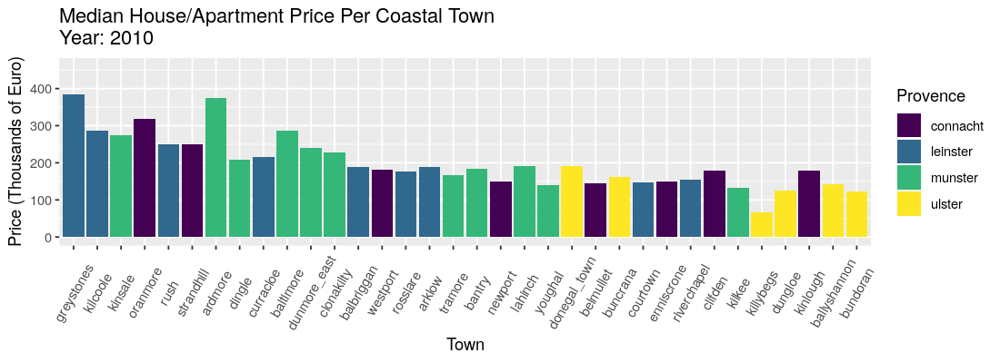
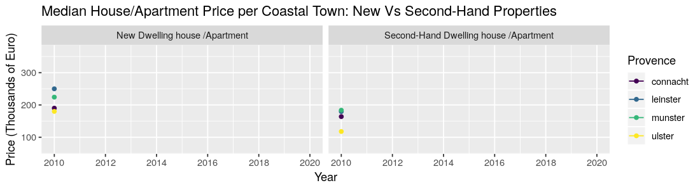

```{r setup, include=FALSE}
knitr::opts_chunk$set(echo = FALSE)
```


```{r message=FALSE, warning=FALSE, include=FALSE}
suppressMessages(library(tidyverse))
suppressMessages(library(ggplot2))
suppressMessages(library(GGally))
suppressMessages(library(dplyr))
suppressMessages(library(gganimate))
install.packages("viridis")
suppressMessages(library(viridis))

```

```{r echo=FALSE}
#hp2 <- read.csv("PPR-ALL-CLEAN.csv")
coastal_towns <- read.csv("Coastal_Towns_Dataset.csv")

#Removing outliers and 1 error
coastal_towns2 <- subset(coastal_towns, X !='238335')
coastal_towns2 <- subset(coastal_towns2, price_adj <= 1500000)

#Grouping and aggreatating
coastal_median <- coastal_towns %>%
  group_by(town, year,provence) %>%
  summarise(median=median(price_adj))
coastal_median$median <- coastal_median$median/1000

#Grouping and aggreatating
Animate_town_median <-  coastal_median %>%
  group_by(town, year,provence) %>%
  summarise(median=median(median))

#Grouping and aggreatating
Prov_median <-coastal_median %>%
  group_by(provence, year) %>%
  summarise(median=median(median))

#For line graph of new vs second-hand
desc <- coastal_towns2 %>%
  group_by(desc, town, provence, year) %>%
  summarise(median = median(price_adj))

desc2 <- desc %>%
  group_by(desc, year, provence) %>%
  summarise(median = median(median))

```

***Coastal Towns***

Ireland being a small island nation means it has many coastal towns, both historic and newly developed. All the major cities in Ireland are close to the sea. This section of the report will focus on the financial impact the 2008 recession had on smaller coastal towns, and how much they have recovered. The 40 towns were grouped by provence to see which area of the country faired best after the recession.


```{r echo=FALSE, fig.height = 6, fig.width = 12, fig.align = "center"}

```

The barplot shows a total decrease in property prices across the whole of Ireland. This downward trend began in 2008, before the earlest year in this dataset. It is not until 2014/2015 that prices begin to increase again. The house prices in Leinster and Munster coastal towns rebound faster than those in Ulster. Connacht towns appear on both ends of the house/apartment price scale, revealing that this provence has both wealthy towns and poorer ones.


```{r echo=FALSE,fig.height = 5, fig.width = 10, fig.align = "center"}


```


The line graph above shows the difference when coastal town house/apartment prices are broken up between new properties and second-hand properties. Both are at the lowest median price around 2012/2013. The second-hand prices are more steady in their decrease and eventual increase. The price of new properties is much more reactive and more prone to sharp increases or decreases. In the last 2 years, the cost of a new house in Leinster, Munster and Connacht has skyrocketd. The plot also reveals that Ulster is much different to the other provences, in that the price for new and second-hand properties are roughly the same throughout the last 10 years.
