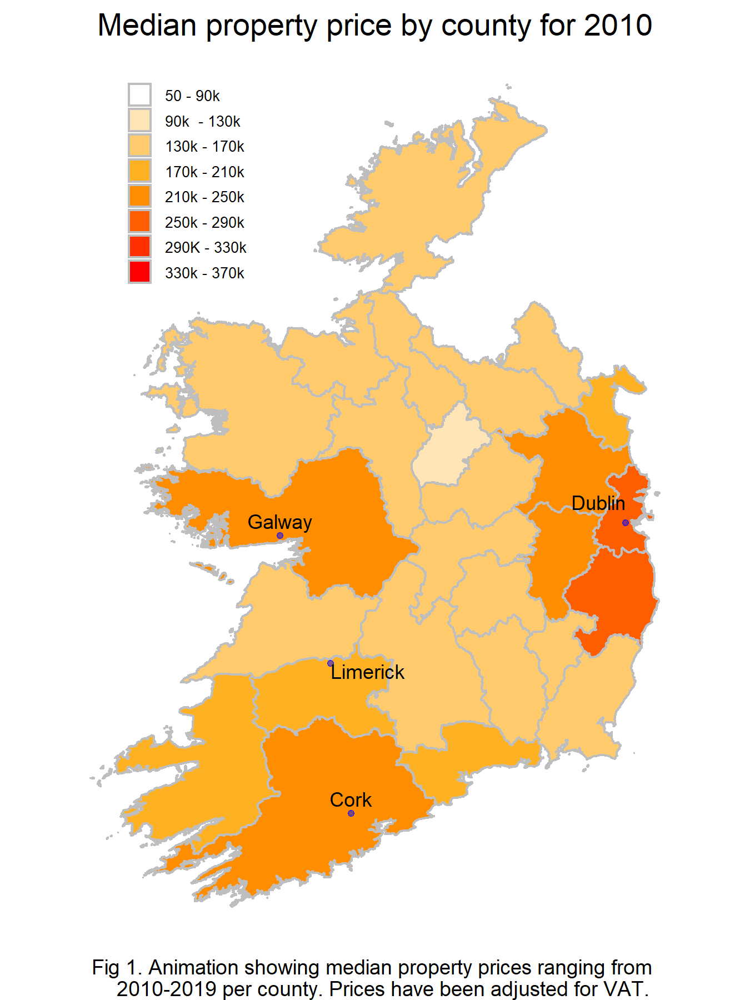

<!-- Code to justify the text and set the font size --> 
<style>
<!-- h1.title { -->
<!--   font-size: 32px; -->
<!-- } -->
<!-- h3{ -->
<!--   text-align:left; -->
<!--   font-size: 22px; -->
<!--   color: Black; -->
<!-- } -->
body {
  text-align: justify;
  color: black;
  <!-- font-size: 10pt; -->
}
.dygraph-title {
  text-align: right;
  color: black;
  font-weight: bold;
  font-size: 15px;
}
</style>

```{r setup, include=FALSE, echo=FALSE}
knitr::opts_chunk$set(echo = FALSE)
```


```{r}
## Load libraries
# dplyr should be always loaded after plyr to avoid group_by from failing
if("dplyr" %in% (.packages())){
  suppressMessages(detach("package:dplyr"))
  if("plyr" %in% (.packages())){
    suppressMessages(detach("package:plyr"))
  }
}
suppressMessages(library(plyr))
suppressMessages(library(dplyr))
suppressMessages(library(tidyverse))
suppressMessages(library(lubridate))
suppressMessages(library(plotly))
suppressMessages(library(ggplot2))
suppressMessages(library(GGally))
suppressMessages(library(dygraphs))
suppressMessages(library(xts))
```


### Abstract

The objective of this project is to analyse the housing market in Ireland from 2010 to 2019 using strong visualisations to support our analysis. We will also offer house price predictions for 2020 through to 2022. In addtion we will conduct a more granular study of commuter and costal towns offering analysis of trends relating to this data. In the next section we will provide a general overview starting with a brief discussion about the recession, its effects and the aftermath. This will be followed by a look at changes in house prices over time at a regional level in Ireland.


### Overview

The global economic crash of 2008 had a profound effect on the housing market in Ireland.[2] Ireland was severly hit becomming the first european country to offically enter recession status in september of 2008 and which lasted well into 2013 and which effectively brought to an end to what is colloquially refered to as the 'Celtic Tiger', a period of economic growth that originated in the early 1990's.

```{r fig.width= 6, fig.height= 3, out.width= "50%", out.extra='style="float:right; padding:10px"', echo=FALSE}

```


One of the primary reasons the economy was so deeply effected was due to a property bubble which arose due to poor financial regulatory practices relating to lending and mortage policies by banks.[3]


To aid in our overview a Choropleth animation was created using data from the Ordinance Survey Ireland group.[4] The chloropleth animation shows the median property prices for each county for each year ranging from 2010 to 2019 (Fig. 1). A property in this context can mostly be defined as either an apartment or a house. Starting in 2010 we can see a continued decline in median property prices country wide up until 2013. At this point property prices for 11 counties had a median price of 90K or less. After 2013 propety prices in general begin to recover increasing year on year for most counties. A point of note is Dublin which has the greatest increase in median price and from 2017 on the surrounding counties of Meath, Kildare and Wicklow had median prices above 210K. By the end of 2019 Galway and Cork also went above the median price of 210K.


In general property prices appear to be increasing and further detail will be given in the following sections


### Data Cleansing

Before data analysis commenced, the dataset was read-in and examined, and from this, we decided to remove redundant variables, and create a new column which contained only the year for each observation. Addresses and county names were converted to lower case for ease of screening and filtering, and symbols were removed from these variables. The price variable required removal of the euro symbol and commas, and new properties had their prices adjusted to include VAT - this was stored in a new variable 'price_adj'. The dataset was checked for missing values (none present), and was examined for outliers. Approximately 5% of the dataset contained properties not at full market price, however we left these in in order to include them in our analysis. There were a number of low priced properties - we decided to keep these in as they could reflect 'glorified cow sheds', bedsits above a shop, or a very small plot of land (particularly during the recession when prices were at an all time low). Higher priced observations were looked at in more detail, with the majority identified as multi-unit properties. The final step in the data cleansing section involved splitting these properties into separate observations, each imputed with the mean adjusted price for that address. Observations greater than 10 million euros were removed as we felt that these most likely represented multi-unit properties rather than an individual property. There are a number of duplicates in the dataset, however some are genuine (the same property sold more than once), some are present as an artifact of splitting multi-unit properties, with the remainder as either genuine errors or multiple properties sold together under the one address. As there was no way of determining which were errors and which were genuine, we left them in. We felt the time cost of trying to extract the genuine errors from the data outbalanced the value of doing it.


```{r}
## Load PPR dataset

#hp <- read.csv("../data/PPR-ALL.csv", header=F) 
hp <- read.csv("data/PPR-ALL.csv", header=F) 
# header=F as wouldn't load otherwise due to euro symbol for price

# Add column names
names(hp) <- c("sale_date","address","post_code","county","price","nfmp","vx","desc","size_desc")
# same as Fergal's for consistency

# Remove redundant header names (row 1)
hp<-hp[-1, ] 

# Remove redundant variables (post_code and size_desc)
hp<-hp[,-c(3,9)]
```


```{r}
## Create a new column for year only

hp$sale_date<-dmy(hp$sale_date)
hp$year<-year(hp$sale_date)
```


```{r}
## Manipulate address and county variables - change to all lower case

# remove funny symbols from address
hp$address <-str_replace_all(hp$address,"[^[:graph:]]", " ")

# change addresses to all lowercase to facilitate town name search
hp <- hp %>% mutate(address = tolower(address))
hp <- hp %>% mutate(county = tolower(county))
```


```{r}
## Manipulate price variable 

# Remove euro symbol and comma from price values
hp$price <- gsub('[\x80]','', hp$price)
hp$price <- gsub('[,]','', hp$price)

# convert price to numeric
hp1 <- hp %>% mutate_at("price", as.numeric)

# make all values inclusive of VAT (new property: the price shown should be exclusive of VAT at 13.5%)
hp1$price_adj <- ifelse(hp1$vx =='Yes', hp1$price*1.135, hp1$price*1)
```


```{r}
## Outlier check

# check for missing values
miss <- hp1[!complete.cases(hp1),] 
# no missing values

# how many properties are not the full market price
nfmp <- subset(hp1, nfmp=="Yes") 
# 20256 obs (nearly 5% of the dataset) - we've decided to keep these in the dataset

# check how many really large and really low values we have
f <- fivenum(hp1$price_adj)
# there is a huge jump between the minimum value and lower quartile, and similarly between the upper quartile and maximum value

# number of outliers
out <- length(boxplot.stats(hp1$price_adj)$out) 
# 22145. However threshold for high house price outliers is 586452.50, which is too low in my opinion.

hp1_dup <- hp1
dup_idx <- duplicated(hp1_dup)
dup_rows1 <- hp1_dup[dup_idx, ]
# 594 duplicates. There are often scenarios where a developer may buy several properties for a single sum on a particular date. This transaction can be entered multiple times for each property but under the same address for the same amount. Some duplicates are genuine errors which the PPR acknowledges. As the amount of duplicates represents less than 0.2% of the dataset, spread across many towns and counties, we left duplicates as is, as we felt the time cost of trying to extract the genuine errors from the data outbalanced the value of doing it. 

```


```{r, message=FALSE}
## Multi-unit properites

# There are issues with the multi-unit properties due to the fact that they are not consistently recorded within the dataset. Some are entered as a range, however others use text ('XXX apts' or 'apartments') or '&' etc. 

# Used to insure counts are correct
nrow <- nrow(hp1)

# Drop complex address groupings e.g. 1-2, 4-7 Greenlane Apts ;  
complex_grouping <- hp1 %>%
  filter(grepl('^[0-9]+-[0-9]+.*[0-9]+-[0-9]+', address))

notable_exception <- hp1 %>% filter(grepl('^[0-9]+-[0-9]+.*[0-9]+\ -\ [0-9]+', address))

hp1 <- anti_join(hp1, complex_grouping)
hp1 <- anti_join(hp1, notable_exception)


# Drop less than a million
lessMil <- hp1 %>% filter(price_adj <= 1000000)%>%
  filter(grepl('^[0-9]+-[0-9]+', address))

hp1 <- anti_join(hp1, lessMil)

# Filter properties over a million and impute mean
filter1 <- hp1 %>%
  filter(price >1000000) %>%
  filter(grepl('^[0-9]+-[0-9]+', address)) %>%
  mutate(estnum = abs(parse_number(str_match(address, '^*-[0-9]+'))) 
                                - abs(parse_number(str_match(address, '^[0-9]+'))) +1 ) %>%
  mutate(imputed_mean = price_adj/estnum)

# Want to uncount addresses
filter2 <- filter1 %>%
  uncount(estnum) %>%
  mutate(price_adj = imputed_mean)

filter3 <- select(filter2,-c(imputed_mean))

hp1 <- anti_join(hp1, filter1)
hp1 <- full_join(hp1, filter3)


# Remove properties which are >10 million as these are most likely multi-unit properties which do not conform to expected
# naming criteria for multi-unit properties
hp2 <- subset(hp1, price_adj <= 10000000)

#write.csv(hp2, "../data/PPR-ALL-CLEAN.csv") 


```


### House price change by region

Ireland can be divided into geographical regions, namely, North East, Eastern, South East, Southern, South West, Western, North West, Northern and the Midlands. For each region, four towns were selected ranging from urban or large towns (orange lines) to more rural (red < 10km from urban centre, blue < 30km and purple > 30km from urban centre). In general large towns, and towns within 10 km of these, tended to have the highest median house prices across all years and regions, with Strandhill in the North West being the most extreme case of these. Noticeable exceptions include Maynooth for the Eastern region, and Slane for the North East, where both towns exceed the median house price of the more urban areas. This could be explained in part by the fact that the proportion of houses to apartments increases further out from urban areas, with houses typically selling at a higher price than apartments. Slane lies between Navan and Drogheda so is probably a popular commuter town, as is Maynooth, which drives up house prices. The North showed very little differentiation between urban and more rural towns, and along with the midlands, had the lowest median house prices of all the regions. The Eastern region had the highest median house prices. As seen in the overview above, most towns saw a drop in median house prices from 2010 to 2012/2013, with the majority seeing a recovery and upwards trend in house prices from 2014 onwards.


```{r}
## Read in the clean dataset
hp_clean <- read.csv("./data/PPR-ALL-CLEAN.csv")

# remove funny symbols from address
hp_clean$address <-str_replace_all(hp_clean$address,"[^[:alnum:]]", " ")
hp3 <- hp_clean

```


```{r}
## pull selection of towns from different regions around Ireland

# try to write a function to shorten this if I have time

smithfield <- hp3[grepl("smithfield", hp3[["address"]]) & grepl("dublin", hp3[["county"]]), ]
smithfield$town <- rep("Smithfield",nrow(smithfield))
smithfield$region <- rep("Eastern", nrow(smithfield))
smithfield$dist <- rep("0 km", nrow(smithfield))

tallaght <- hp3[grepl("tallaght", hp3[["address"]]) & grepl("dublin", hp3[["county"]]), ]
tallaght$town <- rep("Tallaght",nrow(tallaght))
tallaght$region <- rep("Eastern", nrow(tallaght))
tallaght$dist <- rep("<10 km", nrow(tallaght))

maynooth <- hp3[grepl("maynooth", hp3[["address"]]) & grepl("kildare", hp3[["county"]]), ]
maynooth$town <- rep("Maynooth",nrow(maynooth))
maynooth$region <- rep("Eastern", nrow(maynooth))
maynooth$dist <- rep("<30 km", nrow(maynooth))

newbridge <- hp3[grepl("newbridge", hp3[["address"]]) & grepl("kildare", hp3[["county"]]), ]
newbridge$town <- rep("Newbridge",nrow(newbridge))
newbridge$region <- rep("Eastern", nrow(newbridge))
newbridge$dist <- rep(">30 km", nrow(newbridge))

cork_city <- hp3[grepl("cork city", hp3[["address"]]) & grepl("cork", hp3[["county"]]), ]
cork_city$town <- rep("Cork City",nrow(cork_city))
cork_city$region <- rep("Southern", nrow(cork_city))
cork_city$dist <- rep("0 km", nrow(cork_city))

blarney <- hp3[grepl("blarney", hp3[["address"]]) & grepl("cork", hp3[["county"]]), ]
blarney$town <- rep("Blarney",nrow(blarney))
blarney$region <- rep("Southern", nrow(blarney))
blarney$dist <- rep("<10 km", nrow(blarney))

mallow <- hp3[grepl("mallow", hp3[["address"]]) & grepl("cork", hp3[["county"]]), ]
mallow$town <- rep("Mallow",nrow(mallow))
mallow$region <- rep("Southern", nrow(mallow))
mallow$dist <- rep("<30 km", nrow(mallow))

charleville <- hp3[grepl("charleville", hp3[["address"]]) & grepl("cork", hp3[["county"]]), ]
charleville$town <- rep("Charleville",nrow(charleville))
charleville$region <- rep("Southern", nrow(charleville))
charleville$dist <- rep(">30 km", nrow(charleville))

galway_city <- hp3[grepl("galway city", hp3[["address"]]) & grepl("galway", hp3[["county"]]), ]
galway_city$town <- rep("Galway City",nrow(galway_city))
galway_city$region <- rep("Western", nrow(galway_city))
galway_city$dist <- rep("0 km", nrow(galway_city))

oranmore <- hp3[grepl("oranmore", hp3[["address"]]) & grepl("galway", hp3[["county"]]), ]
oranmore$town <- rep("Oranmore",nrow(oranmore))
oranmore$region <- rep("Western", nrow(oranmore))
oranmore$dist <- rep("<10 km", nrow(oranmore))

athenry <- hp3[grepl("athenry", hp3[["address"]]) & grepl("galway", hp3[["county"]]), ]
athenry$town <- rep("Athenry",nrow(athenry))
athenry$region <- rep("Western", nrow(athenry))
athenry$dist <- rep("<30 km", nrow(athenry))

loughrea <- hp3[grepl("loughrea", hp3[["address"]]) & grepl("galway", hp3[["county"]]), ]
loughrea$town <- rep("Loughrea",nrow(loughrea))
loughrea$region <- rep("Western", nrow(loughrea))
loughrea$dist <- rep(">30 km", nrow(loughrea))

limerick_city <- hp3[grepl("limerick city", hp3[["address"]]) & grepl("limerick", hp3[["county"]]), ]
limerick_city$town <- rep("Limerick City",nrow(limerick_city))
limerick_city$region <- rep("South West", nrow(limerick_city))
limerick_city$dist <- rep("0 km", nrow(limerick_city))

croom <- hp3[grepl("croom", hp3[["address"]]) & grepl("limerick", hp3[["county"]]), ]
croom$town <- rep("Croom",nrow(croom))
croom$region <- rep("South West", nrow(croom))
croom$dist <- rep("<10 km", nrow(croom))

castletroy <- hp3[grepl("castletroy", hp3[["address"]]) & grepl("limerick", hp3[["county"]]), ]
castletroy$town <- rep("Castletroy",nrow(castletroy))
castletroy$region <- rep("South West", nrow(castletroy))
castletroy$dist <- rep("<30 km", nrow(castletroy))

abbeyfeale <- hp3[grepl("abbeyfeale", hp3[["address"]]) & grepl("limerick", hp3[["county"]]), ]
abbeyfeale$town <- rep("Abbeyfeale",nrow(abbeyfeale))
abbeyfeale$region <- rep("South West", nrow(abbeyfeale))
abbeyfeale$dist <- rep(">30 km", nrow(abbeyfeale))

drogheda <- hp3[grepl("drogheda", hp3[["address"]]) & grepl("meath", hp3[["county"]]), ]
drogheda$town <- rep("Drogheda",nrow(drogheda))
drogheda$region <- rep("North East", nrow(drogheda))
drogheda$dist <- rep("0 km", nrow(drogheda))

bettystown <- hp3[grepl("bettystown", hp3[["address"]]) & grepl("meath", hp3[["county"]]), ]
bettystown$town <- rep("Bettystown",nrow(bettystown))
bettystown$region <- rep("North East", nrow(bettystown))
bettystown$dist <- rep("<10km", nrow(bettystown))

slane <- hp3[grepl("slane", hp3[["address"]]) & grepl("meath", hp3[["county"]]), ]
slane$town <- rep("Slane",nrow(slane))
slane$region <- rep("North East", nrow(slane))
slane$dist <- rep("<30km", nrow(slane))

nobber <- hp3[grepl("nobber", hp3[["address"]]) & grepl("meath", hp3[["county"]]), ]
nobber$town <- rep("Nobber",nrow(nobber))
nobber$region <- rep("North East", nrow(nobber))
nobber$dist <- rep(">30 km", nrow(nobber))

strandhill <- hp3[grepl("strandhill", hp3[["address"]]) & grepl("sligo", hp3[["county"]]), ]
strandhill$town <- rep("Strandhill",nrow(strandhill))
strandhill$region <- rep("North West", nrow(strandhill))
strandhill$dist <- rep("0 km", nrow(strandhill))

collooney <- hp3[grepl("collooney", hp3[["address"]]) & grepl("sligo", hp3[["county"]]), ]
collooney$town <- rep("Collooney",nrow(collooney))
collooney$region <- rep("North West", nrow(collooney))
collooney$dist <- rep("<10 km", nrow(collooney))

ballymote <- hp3[grepl("ballymote", hp3[["address"]]) & grepl("sligo", hp3[["county"]]), ]
ballymote$town <- rep("Ballymote",nrow(ballymote))
ballymote$region <- rep("North West", nrow(ballymote))
ballymote$dist <- rep("<30 km", nrow(ballymote))

ballaghadereen <- hp3[grepl("ballaghadereen", hp3[["address"]]) & grepl("roscommon", hp3[["county"]]), ]
ballaghadereen$town <- rep("Ballaghadereen",nrow(ballaghadereen))
ballaghadereen$region <- rep("North West", nrow(ballaghadereen))
ballaghadereen$dist <- rep(">30 km", nrow(ballaghadereen))

letterkenny <- hp3[grepl("letterkenny", hp3[["address"]]) & grepl("donegal", hp3[["county"]]), ]
letterkenny$town <- rep("Letterkenny",nrow(letterkenny))
letterkenny$region <- rep("North", nrow(letterkenny))
letterkenny$dist <- rep("0 km", nrow(letterkenny))

manorcunningham <- hp3[grepl("manorcunningham", hp3[["address"]]) & grepl("donegal", hp3[["county"]]), ]
manorcunningham$town <- rep("Manorcunningham",nrow(manorcunningham))
manorcunningham$region <- rep("North", nrow(manorcunningham))
manorcunningham$dist <- rep("<10 km", nrow(manorcunningham))

ballybofey <- hp3[grepl("ballybofey", hp3[["address"]]) & grepl("donegal", hp3[["county"]]), ]
ballybofey$town <- rep("Ballybofey",nrow(ballybofey))
ballybofey$region <- rep("North", nrow(ballybofey))
ballybofey$dist <- rep("<30 km", nrow(ballybofey))

ardara <- hp3[grepl("ardara", hp3[["address"]]) & grepl("donegal", hp3[["county"]]), ]
ardara$town <- rep("Ardara",nrow(ardara))
ardara$region <- rep("North", nrow(ardara))
ardara$dist <- rep(">30 km", nrow(ardara))

athlone <- hp3[grepl("athlone", hp3[["address"]]) & grepl("westmeath", hp3[["county"]]), ]
athlone$town <- rep("Athlone",nrow(athlone))
athlone$region <- rep("Midlands", nrow(athlone))
athlone$dist <- rep("0 km", nrow(athlone))

moate <- hp3[grepl("moate", hp3[["address"]]) & grepl("westmeath", hp3[["county"]]), ]
moate$town <- rep("Moate",nrow(moate))
moate$region <- rep("Midlands", nrow(moate))
moate$dist <- rep("<10 km", nrow(moate))

ballymahon <- hp3[grepl("ballymahon", hp3[["address"]]) & grepl("longford", hp3[["county"]]), ]
ballymahon$town <- rep("Ballymahon",nrow(ballymahon))
ballymahon$region <- rep("Midlands", nrow(ballymahon))
ballymahon$dist <- rep("<30 km", nrow(ballymahon))

edgeworthstown <- hp3[grepl("edgeworthstown", hp3[["address"]]) & grepl("longford", hp3[["county"]]), ]
edgeworthstown$town <- rep("Edgeworthstown",nrow(edgeworthstown))
edgeworthstown$region <- rep("Midlands", nrow(edgeworthstown))
edgeworthstown$dist <- rep(">30 km", nrow(edgeworthstown))

coolcotts <- hp3[grepl("coolcotts", hp3[["address"]]) & grepl("wexford", hp3[["county"]]), ]
coolcotts$town <- rep("Coolcotts",nrow(coolcotts))
coolcotts$region <- rep("South East", nrow(coolcotts))
coolcotts$dist <- rep("0 km", nrow(coolcotts))

castlebridge <- hp3[grepl("castlebridge", hp3[["address"]]) & grepl("wexford", hp3[["county"]]), ]
castlebridge$town <- rep("Castlebridge",nrow(castlebridge))
castlebridge$region <- rep("South East", nrow(castlebridge))
castlebridge$dist <- rep("<10 km", nrow(castlebridge))

kilmuckridge <- hp3[grepl("kilmuckridge", hp3[["address"]]) & grepl("wexford", hp3[["county"]]), ]
kilmuckridge$town <- rep("Kilmuckridge",nrow(kilmuckridge))
kilmuckridge$region <- rep("South East", nrow(kilmuckridge))
kilmuckridge$dist <- rep("<30 km", nrow(kilmuckridge))

bunclody <- hp3[grepl("bunclody", hp3[["address"]]) & grepl("wexford", hp3[["county"]]), ]
bunclody$town <- rep("Bunclody",nrow(bunclody))
bunclody$region <- rep("South East", nrow(bunclody))
bunclody$dist <- rep(">30 km", nrow(bunclody))
```


```{r}
## combine town datasets together
hp_town <- rbind(smithfield, tallaght, maynooth, newbridge, cork_city, blarney, mallow, charleville, galway_city, oranmore, athenry, loughrea, limerick_city, croom, castletroy, abbeyfeale, drogheda, bettystown, slane, nobber, strandhill, collooney, ballymote, ballaghadereen, letterkenny, manorcunningham, ballybofey, ardara, athlone, moate, ballymahon, edgeworthstown, coolcotts, castlebridge, kilmuckridge, bunclody)

# write.csv(hp_town, "hp_town.csv")
```


```{r}
## plot towns
change <- 
  hp_town %>%
    group_by(year, town, region, dist) %>%
    summarise(hprice=median(price/1000))

change$town_f <- factor(change$town, levels=c("Drogheda", "Bettystown", "Slane", "Nobber","Smithfield", "Tallaght", "Maynooth", "Newbridge","Athlone", "Moate", "Ballymahon", "Edgeworthstown", "Coolcotts", "Castlebridge", "Kilmuckridge", "Bunclody", "Cork City", "Blarney", "Mallow", "Charleville", "Limerick City", "Castletroy", "Croom", "Abbeyfeale", "Galway City", "Oranmore", "Athenry", "Loughrea", "Strandhill", "Collooney", "Ballymote", "Ballaghadereen", "Letterkenny", "Manorcunningham","Ballybofey","Ardara"))

colours <- rep(c("orange", "red", "blue", "purple"),10)

p<- ggplot(change, aes(x=year, y=hprice, color=town_f))+
  geom_line()+
  facet_wrap(~region)+
  scale_x_continuous(limits= c(2010, 2020), breaks=c(2010, 2012, 2014, 2016,2018, 2020),labels=c("'10", "'12", "'14", "'16", "'18", "'20"))+
  scale_y_continuous(limits=c(0, 400), breaks=c(0,100,200,300,400))+
  labs(title="House price change for towns within different regions of Ireland (2010-2020)",
       x ="Year of Sale", y = "Median house price (euros/1000)" )
p1 <- p + theme(legend.position = "none", axis.title = element_text(size=9), axis.text = element_text(size=8),
                plot.title=element_text(face="bold", size=10),
                plot.caption=element_text(hjust=0))+
  scale_color_manual(breaks=change$dist, values=colours)
gp <- ggplotly(p1)
#gp

# find annotation I want to move
#str <- str(gp[['x']][['layout']][['annotations']]) 

# check current location of label
#check <- gp[['x']][['layout']][['annotations']][[2]][['x']]

gp[['x']][['layout']][['annotations']][[1]][['y']] <- -0.045
gp[['x']][['layout']][['annotations']][[2]][['x']] <- -0.05
gp %>% layout(annotations = 
 list(x = 1, y = -0.085, text = "ORANGE: Urban. RED: <10 km from urban. BLUE: <30 km from urban. PURPLE: >30 km from urban", 
      showarrow = F, xref='paper', yref='paper', 
      xanchor='right', yanchor='auto', xshift=0, yshift=-14,
      font=list(size=8, color="black")))

```


### Analysis of Dublin Commuter Belt

The Dublin commuter belt was originally an area of land beyond the M50 motorway where people who worked in the city would buy homes which were more affordable than the properties in the inner city. The Dublin commuter belt initially comprised towns such as Lucan and Swords. However, since the height of the housing bubble in the early 2000’s the Dublin commuter belt began to spread into the adjoining counties of Kildare and Meath until it’s halt was eventually precipitated by the 2008 housing collapse. The heat map below shows the median house and apartment prices in the period from 2010 to 2019 in the counties of Kildare and Meath. The heat map is illustrative of the sharp fall in property prices that was witnessed in the years from 2011 until 2013 followed by a resurgence in property prices from mid 2014 onwards. Property prices grew strongly from 2014 where the median price was €193,000 until the end of 2019 where the median price had risen to €268,722 in the Kildare, Meath areas.[5] 

```{r echo=FALSE}
# Read in Data
country_data <- read.csv("data/PPR-ALL-CLEAN.csv")
kildare_data <- country_data[country_data$county == "kildare",]
meath_data <- country_data[country_data$county == "meath",]
house_clean <- rbind(kildare_data, meath_data)
house_clean <- house_clean[,-1]

names(house_clean) <- c("Date","Address","County","Price","Not Full Price","VAT Exclusive","Description","Year","Price_adj")
dates_orginal <- house_clean[,1]
dates_orginal <- strptime(as.character(dates_orginal), "%Y-%m-%d")
dates_orginal <- format(dates_orginal, "%d/%m/%Y")
house_clean[,1] <- as.character(house_clean[,1])

date_long <- substring(house_clean[,1],str_length(house_clean[,1])-9)

my_month <- as.numeric(substring( date_long,6, 7))

dayf <- as.numeric(substring(date_long,9, 10))

my_months <- c("Jan","Feb","Mar","Apr","May","Jun","Jul","Aug","Sep","Oct","Nov","Dec")

# Drop Postal Code
house_clean <- house_clean[,1:8]
house_clean <- house_clean[,c(1:2,4:8)]


house_clean <- mutate(house_clean,
                      monthf = my_months[my_month],
                      weekdayf = substring(weekdays(as.Date(dates_orginal, "%d/%m/%Y")),1,3),
                      monthweek =  1 + 
                      ceiling(as.numeric(difftime(as.Date(dates_orginal, "%d/%m/%Y"), 
                              as.Date(paste0(substr(as.Date(dates_orginal, "%d/%m/%Y"),1,8),'01')), units = "weeks")))
                              , week= monthweek
                      )

house_clean <- mutate(house_clean,
                      full_date = dates_orginal
                      )

house_clean <- house_clean[house_clean$Date < 2020,]
house_clean <- house_clean[house_clean$Price > 60000,]
house_clean <- house_clean[house_clean$Price < 1500000,]
median_prices <- ddply(house_clean, .(full_date), summarize, mean_Price_for_day = round(median(Price)/1000,0))

median_prices <- mutate(median_prices,
                        monthf = substring(months(as.Date(median_prices$full_date)),1,3),
                        weekdayf = substring(weekdays(as.Date(median_prices$full_date)),1,3),
                        monthweek =  1 + 
                        ceiling(as.numeric(difftime(as.Date(median_prices$full_date, "%d/%m/%Y"), 
                                as.Date(paste0(substr(as.Date(median_prices$full_date, "%d/%m/%Y"),1,8),'01')), units = "weeks")))
                        , week= monthweek,
                        Date = substring(as.character(median_prices$full_date),str_length(median_prices$full_date)- 3 )
                 
                        )
median_prices <- median_prices[(median_prices[,2] < 450) & (median_prices[,2] > 60) ,]


median_prices$monthf <- factor(median_prices$monthf,labels=c("Jan","Feb","Mar","Apr","May","Jun","Jul","Aug","Sep","Oct","Nov","Dec"), ordered= T)


```

```{r, fig.width=9, fig.height= 6,eval=T, echo=FALSE}
 # Heat Map of Kildare and Meath house prices
ggplot(median_prices, aes(monthweek, weekdayf, fill = mean_Price_for_day )) + 
  geom_tile(colour = "white") + 
  facet_grid(Date~monthf ) + 
  scale_fill_gradient(low="yellow", high="red") +
  labs(x="Week of Month",
       y="",
       title = "Calendar Heatmap of Median Prices From 2010-2019", 
       subtitle="Commuter Belt - Kildare, Meath", 
       fill="Prices")+
  theme(
        #axis.text.y=element_blank(),
        #axis.ticks.y=element_blank(),
        axis.text.y = element_text(size=4.0)
        ) 

```

<!-- <hr> -->
### Comparision of New properties vs Second-hand properties
<!-- <hr> -->

```{r}
#Loading Data

#Reading the data, Excluding the header since the euro sign is creating a error loading the data because of the encoding issues.
# hp <- read.csv("data/PPR-ALL-CLEAN.csv", header = FALSE)

#Using the already loaded clean data
hp4 <- hp_clean

#Using the already loaded clean data and removing the index column
hp4 <- hp4[,-1]

#Setting the header values: commenting since already set before
#names(hp4) <- c("sale_date","address","county","price","nfmp","vx","desc","year","price_adj")

#Removing the extra header: commenting since already accomplished above
# hp4<-hp4[-1, ]

#Removing rows that contained a small amount of Irish language descriptions of properties
hp4 <- subset(hp4, desc=='New Dwelling house /Apartment' | desc=='Second-Hand Dwelling house /Apartment')

# head(hp4)
# hp_count <- count(hp4,county)
# hp_count <- hp_count[order(-hp_count$n),]
# hp_count

#Data Cleaning

#Commenting since task completed above
#hp4$address    <- as.character(hp4$address)
#hp4$county     <- as.factor(hp4$county)
#hp4$nfmp       <- as.factor(hp4$nfmp)
#hp4$vx         <- as.factor(hp4$vx)
#hp4$sale_date  <- as.Date(hp4$sale_date)
# hp4$price      <- as.numeric(as.character(hp4$price))
# hp4$price_adj  <- as.numeric(as.character(hp4$price_adj))

#Converting sale_date to year quarter format
hp4$sale_date <- as.yearqtr(hp4$sale_date, format = "%Y-%m-%d")

# head(hp)
```

```{r}
#Subsetting only dublin towns with New and Second house /Apartment information
hp5 <- subset(hp4, county == 'dublin')

#Grouping data by desc and sale date and calculating the corresponding median price
hp5 <- aggregate(hp5[, 9], list(hp5$desc,hp5$sale_date), median)
names(hp5) <- c("desc","sale_date","med_price")

#Converting price to 1000's
hp5$med_price <- hp5$med_price/1000

# hp5 <- hp5 %>% group_by(desc,sale_date) %>% summarise(med_price = median(price_adj/1000))

#spreading the data to get the desired format
hp5 <- spread(hp5, desc, med_price) 

#creating the time series
hp5_ts <-xts(x = hp5, order.by = hp5$sale_date)

#creating the dygraph which is an interactive plot to show the comparision between new and second-hand properties in Dublin
hp5_dub_dyg <- dygraph(hp5_ts, width = 400, height = 300, group = "nh_sh", main = "Dublin New vs Second-Hand Houses/Apartments") %>% 
  dyAxis("y", label = "Median House Price(in 1000's)") %>%
  dyOptions(labelsUTC = TRUE, fillGraph=TRUE, fillAlpha=0.1, drawGrid = TRUE) %>%
  dyRangeSelector() %>%
  dyCrosshair(direction = "vertical") %>%
  dyHighlight(highlightCircleSize = 4, 
              highlightSeriesBackgroundAlpha = 0.5,
              hideOnMouseOut = TRUE)%>%
  dyLegend(show = "follow")%>%
  dyShading(from="2012-6-15", to="2013-12-15", color="#F7CED7FF") %>%
  dyShading(from="2019-4-15", to="2020-1-15", color="#CBFFCB")

#Subsetting other towns with New and Second house /Apartment information
hp6 <- subset(hp4, county != 'dublin')

#Grouping data by desc and sale date and calculating the corresponding median price
hp6 <- aggregate(hp6[, 9], list(hp6$desc,hp6$sale_date), median)
names(hp6) <- c("desc","sale_date","med_price")

#Converting price to 100's
hp6$med_price <- hp6$med_price/1000

# hp6 <- hp6 %>% group_by(desc,sale_date) %>% summarise(med_price = median(price_adj))

#spreading the data to get the desired format
hp6 <- spread(hp6, desc, med_price) 

#creating the time series
hp6_ts <-xts(x = hp6, order.by = hp6$sale_date)

#creating the dygraph which is an interactive plot to show the comparision between new and second-hand properties in other towns
hp6_oth_dyg <- dygraph(hp6_ts, width = 400, height = 300, group = "nh_sh", main = "Other Towns New vs Second-Hand Houses/Apartments") %>% 
  dyAxis("y", label = "Median House Price(in 1000's)") %>%
  dyOptions(labelsUTC = TRUE, fillGraph=TRUE, fillAlpha=0.1, drawGrid = TRUE) %>%
  dyRangeSelector() %>%
  dyCrosshair(direction = "vertical") %>%
  dyHighlight(highlightCircleSize = 4, 
              highlightSeriesBackgroundAlpha = 0.5,
              hideOnMouseOut = TRUE)%>%
  dyLegend(show = "follow")%>%
  dyShading(from="2013-1-15", to="2014-6-15", color="#F7CED7FF")%>%
  dyShading(from="2019-4-15", to="2020-1-15", color="#CBFFCB")

# hp5_dub_dyg
# hp6_oth_dyg

#Creating a list of dygraphs to create a synchronised plot
dy_graph <- list(
  hp5_dub_dyg,hp6_oth_dyg
)  # end list

#htmltools::browsable(htmltools::tagList(dy_graph))
# htmltools::tags$div(dy_graph, style = "padding:10px; width: 450px; border: solid; background-color:#e9e9e9; display:inline-block;")
```

<div style="float:right;padding:0 0 0 20px">
```{r, fig.cap = c("Interactive plot for comparision between New and Second-hand properties")}
#plotting the synchronised dygraphs created aboves
htmltools::tags$div(dy_graph, style = "padding:10px; width: 450px; border: solid; background-color:#e9e9e9; display:inline-block;")
```
</div>

When it comes to house buying there is a huge dilemma whether to buy a new property or a second-hand property and whether to buy it in Dublin towns or other towns. The below interactive plot helps us in making this decision by understanding the trends across the last ten years.

The time-period between Q3 2012 and Q1 2014 marked in red in plot 1 is the lowest point of prices for both new and second-hand properties for the dublin towns. One the other hand, the time-period between Q1 2013 and Q2 2014 marked in red in plot 2 is the lowest point of the prices for both the new and second-hand properties for the other towns excluding dublin. While the new and second-hand properties both see their highest points in Q1 2020 marked in green in both the plots we see a huge difference in the trend of second-hand properties between dublin and other towns.

After the Q1 2014, the second-hand properties of other towns did not increase that much while the second-had properties in dublin shows an increasing trend. This shows us that the second hand prices trend will go even higher and someone who's trying to make an investment in the second-hand properties should prefer buying in the dublin towns compared to the other towns. 

On the other hand, buying a new house/apartment will be profitable both in dublin and other towns on the long run. We see a steady growth in trend of the new house/apartment prices for other towns but in dublin we see a sudden decreasing trend in Q2 2015 which again picked up in the next quarter.

This is the trend analysis that we can see considering the limitation that we do not have information regarding the size of the property and will be impacted by the number of sales in each quarter too.

In the below graph, one can zoom in to any specific time for the last 10 years and compare it's new properties vs second-hand properties trend between dublin and other towns at the same time as the two plots are synchronized too for easy access.

<hr>

### References

[1] <primary-data-source> \
[2] https://en.wikipedia.org/wiki/Post-2008_Irish_economic_downturn \
[3] https://en.wikipedia.org/wiki/Celtic_Tiger \
[4] https://data.gov.ie/dataset/counties-osi-national-statutory-boundaries-generalised-20m/resource/b412ae22-ea13-4ca3-a8be-5ffc21f455f6 \
[5] https://www.irishtimes.com/business/economy/priced-out-home-buyers-drifting-to-dublin-s-commuter-belt-1.4104686