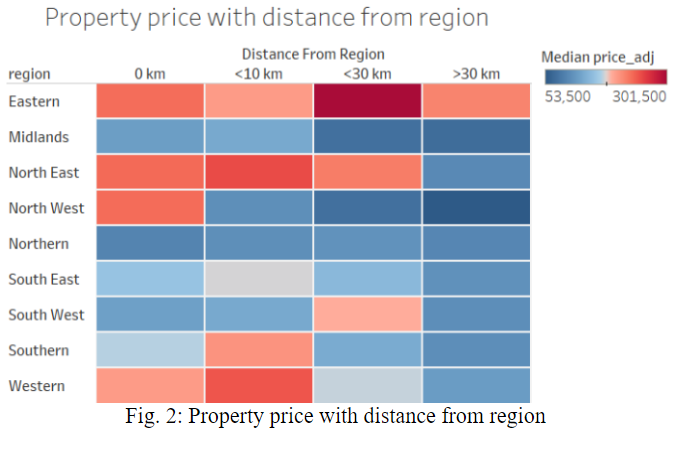
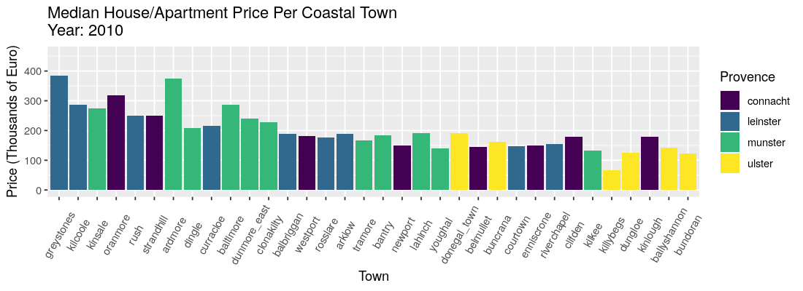
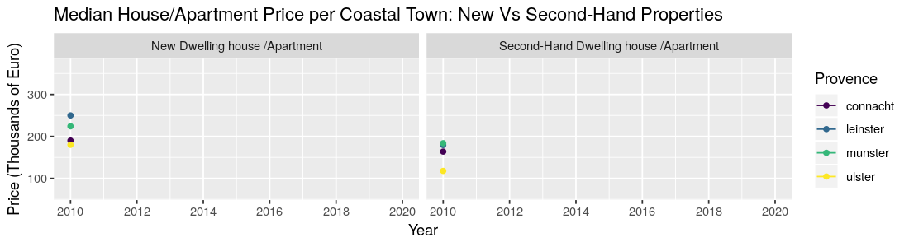

<!-- Code to justify the text and set the font size --> 
<style>
h1.title {
  font-size: 32px;
  font-weight: bold;
}
h4.author {
  font-size: 16px;
  font-style: italic;
}
h4.date {
  font-size: 16px;
  font-style: italic;
}
body {
  text-align: justify;
  color: black;
}
p.caption {
  font-size: 0.85em;
  font-weight: bold;
}
.dygraph-title {
  text-align: right;
  color: black;
  font-weight: bold;
  font-size: 15px;
}
</style>

```{r setup, include=FALSE, echo=FALSE}
knitr::opts_chunk$set(echo = FALSE)
```


```{r}
## Load libraries
# dplyr should be always loaded after plyr to avoid group_by from failing
if("dplyr" %in% (.packages())){
  suppressWarnings(suppressMessages(detach("package:dplyr")))
  if("plyr" %in% (.packages())){
    suppressWarnings(suppressMessages(detach("package:plyr")))
  }
}
suppressWarnings(suppressMessages(library(plyr)))
suppressWarnings(suppressMessages(library(dplyr)))
suppressWarnings(suppressMessages(library(tidyverse)))
suppressWarnings(suppressMessages(library(lubridate)))
suppressWarnings(suppressMessages(library(plotly)))
suppressWarnings(suppressMessages(library(ggplot2)))
suppressWarnings(suppressMessages(library(GGally)))
suppressWarnings(suppressMessages(library(dygraphs)))
suppressWarnings(suppressMessages(library(xts)))

# NOTE: This code was run in and tested using RStudio Server (rstudioserver.hamilton.ie)
```

<hr>
### **Introduction:**
The global economic crash of 2008 had a profound effect on the housing market in Ireland.[1] Ireland was severely hit becoming the first European country to officially enter recession status in September 2008. The recession lasted well into 2013 and effectively brought an end to what is colloquially referred to as the 'Celtic Tiger'; a period of economic growth that originated in the early 1990's.

```{r fig.width= 6, fig.height= 3, out.width= "50%", out.extra='style="float:right; padding:10px"', echo=FALSE}
knitr::include_graphics('./gif/ireland-choropleth-anim.gif')
```


One of the primary reasons the economy was so deeply affected was due to a property bubble which arose due to poor financial regulatory practices relating to lending and mortgage policies by banks.[2]


To aid in our overview a Choropleth animation was created using data from the Ordinance Survey Ireland group.[3] The choropleth animation shows the median property prices for each county for each year ranging from 2010 to 2019 (Fig. 1). A property in this context can mostly be defined as either an apartment or a house. Starting in 2010 we can see a continued decline in median property prices country wide up until 2013. At this point property prices for 11 counties had a median price of 90K or less. After 2013 property prices in general began to recover increasing year on year for most counties. A point of note is Dublin which has the greatest increase in median price and from 2017 on, the surrounding counties of Meath, Kildare and Wicklow had median prices above 210K. By the end of 2019 Galway and Cork also went above the median price of 210K.


In general property prices appear to be increasing and further detail will be given in the following sections.

<hr>
### **Methodology:**
<hr>
#### **Data Cleansing:**

The dataset used in this analysis was downloaded on the 03/04/2020 as a .csv file from the Property Services Regulatory Authority website [4]. At time of download it contained 416380 observations with nine variables. Before data analysis commenced, the dataset was read-in and examined. The price variable required removal of the euro symbol and commas, and new properties had their prices adjusted to include VAT (stored in a new variable 'price_adj'). Redundant variables were removed and a new variable containing just the year of sale was created ('year'). Property addresses and county names were converted to lower case and non-alphanumerical and non-punctuation characters were removed. The dataset was checked for missing values (none present) and outliers. There were a number of very low priced properties - we did not treat these as outliers as they could be either very rundown properties, bedsits above a shop, or a very small plot of land (particularly during the recession when prices were at an all-time low). Higher priced observations were looked at in more detail, with the majority identified as multi-unit properties. The final step in the data cleansing section involved splitting these properties into separate observations, each imputed with the mean adjusted price for that address. Observations greater than 10 million euros were removed as we felt that these most likely represented multi-unit properties rather than an individual property. There are a number of duplicates in the dataset, however some are genuine (the same property sold more than once), some are present as an artefact of splitting multi-unit properties, with the remainder as either genuine errors or multiple properties sold together under the one address. As there was no way of determining which were errors and which were genuine, we left them in. We felt the time cost of trying to extract the genuine errors from the data outbalanced the value of doing it. The cleaned dataset was saved as a .csv and named ‘PPR-ALL-CLEAN.csv’.

#### **Data Manipulation and Extraction:**
There were a number of datasets created in order to explore property price change (2010-2020), and to create our visualisations in the results section. Please refer to the individual .rmd files in the project folder for the methodology used to manipulate and extract the relevant data for each dataset.


```{r, out.width= "45%", out.extra='style="float:right; padding:10px"'}

```

<hr>
### **Exploratory Analysis:**
<hr>
#### **Property price change by region:**
For the first part of our analysis, Ireland was divided into nine geographical regions. Four towns per region were selected: a primary town (urban/large), followed by three more towns with increasing distance from the primary. The aim was two-fold: investigate whether property prices change with increasing distance from the primary town, and determine whether a regional difference in property prices exists.


<div style="float:right; padding:10px">
```{r}

# read in town dataset
hp_town <- read.csv("./data/hp_town.csv")

change <- 
  hp_town %>%
    group_by(year, town, region, dist) %>%
    summarise(hprice=median(price_adj/1000))

# Note: if an error occurs at this point, please re-start RStudio and run code again. This should resolve the issue.
change$town_f <- factor(change$town, levels=c("Drogheda", "Bettystown", "Slane", "Nobber","Smithfield", "Tallaght", "Maynooth", "Newbridge","Athlone", "Moate", "Ballymahon", "Edgeworthstown", "Coolcotts", "Castlebridge", "Kilmuckridge", "Bunclody", "Cork City", "Blarney", "Mallow", "Charleville", "Limerick City", "Castletroy", "Croom", "Abbeyfeale", "Galway City", "Oranmore", "Athenry", "Loughrea", "Strandhill", "Collooney", "Ballymote", "Ballaghadereen", "Letterkenny", "Manorcunningham","Ballybofey","Ardara"))

colours <- rep(c("orange", "red", "blue", "purple"),10)

p <- ggplot(change, aes(x=year, y=hprice, color=town_f))+
  geom_line()+
  facet_wrap(~region)+
  scale_x_continuous(limits= c(2010, 2020), breaks=c(2010, 2012, 2014, 2016,2018, 2020),labels=c("'10", "'12", "'14", "'16", "'18", "'20"))+
  scale_y_continuous(limits=c(0, 400), breaks=c(0,100,200,300,400))+
  labs(title="Fig. 3: Property price change for towns within different regions of Ireland (2010-2020)",
       x ="Year of Sale", y = "Median property price (euros/1000)" )
p1 <- p + theme(legend.position = "none", axis.title = element_text(size=9), axis.text = element_text(size=8),
                plot.title=element_text(face="bold", size=8, hjust = 0.5),
                plot.caption=element_text(hjust=0))+
  scale_color_manual(breaks=change$dist, values=colours)
gp <- ggplotly(p1)


gp[['x']][['layout']][['annotations']][[1]][['y']] <- -0.045
gp[['x']][['layout']][['annotations']][[2]][['x']] <- -0.05
gp %>% layout(annotations = 
 list(x = 1, y = -0.085, text = "Orange: Primary town. Red: <10 km, Blue: <30 km, Purple: >30 km from Primary town", 
      showarrow = F, xref='paper', yref='paper', 
      xanchor='right', yanchor='auto', xshift=0, yshift=-15.5,
      font=list(size=9, color="grey")))

```
</div>

In general, primary towns, and moreso, towns within 10 km of these, tended to have the highest median property prices across all years and regions (Fig. 2, 3). Noticeable exceptions include Maynooth (Eastern) and Slane (North East), where both exceeded the median property price of the primary and it's next closest town, for at least half of the time period (Fig. 3). This could be due to the fact that the proportion of houses to apartments increases further out from urban areas, with houses typically selling at a higher price than apartments. Both towns are also popular commuter towns, with demand pushing up prices in these areas. The North showed very little differentiation between it's four towns (Fig. 2, 3). The Northern region, along with the Midlands and North West (excluding Strandhill), had the lowest median property prices of all the regions (Fig. 3); the Eastern region had the highest (Fig. 2, 3). Most towns saw a drop in median property prices from 2010 to 2012/2013, with the majority seeing a recovery and upwards trend from 2014 onwards (Fig. 3). 


For the next stage of our analysis we looked at property price change in the Dublin commuter belt, followed by property price change in our coastal towns. 

<hr>
#### **Analysis of Dublin Commuter Belt:**

The Dublin commuter belt was originally an area of land beyond the M50 motorway where people who worked in the city would buy homes which were more affordable than the properties in the inner city. The Dublin commuter belt initially comprised towns such as Lucan and Swords. However, since the height of the housing bubble in the early 2000’s the Dublin commuter belt began to spread into the adjoining counties of Kildare and Meath until it’s halt was eventually precipitated by the 2008 housing collapse. The heat map below shows the median house and apartment prices in the period from 2010 to 2019 in the counties of Kildare and Meath. The heat map is illustrative of the sharp fall in property prices that was witnessed in the years from 2011 until 2013 followed by a resurgence in property prices from mid 2014 onwards. Property prices grew strongly from 2014 where the median price was €193,000 until the end of 2019 where the median price had risen to €268,722 in the Kildare, Meath areas.[5] 

```{r echo=FALSE}
# Read in Data
country_data <- read.csv("data/PPR-ALL-CLEAN.csv")
kildare_data <- country_data[country_data$county == "kildare",]
meath_data <- country_data[country_data$county == "meath",]
house_clean <- rbind(kildare_data, meath_data)
house_clean <- house_clean[,-1]

names(house_clean) <- c("Date","Address","County","Price","Not Full Price","VAT Exclusive","Description","Year","Price_adj")
dates_orginal <- house_clean[,1]
dates_orginal <- strptime(as.character(dates_orginal), "%Y-%m-%d")
dates_orginal <- format(dates_orginal, "%d/%m/%Y")
house_clean[,1] <- as.character(house_clean[,1])

date_long <- substring(house_clean[,1],str_length(house_clean[,1])-9)

my_month <- as.numeric(substring( date_long,6, 7))

dayf <- as.numeric(substring(date_long,9, 10))

my_months <- c("Jan","Feb","Mar","Apr","May","Jun","Jul","Aug","Sep","Oct","Nov","Dec")

# Drop Postal Code
house_clean <- house_clean[,1:8]
house_clean <- house_clean[,c(1:2,4:8)]


house_clean <- mutate(house_clean,
                      monthf = my_months[my_month],
                      weekdayf = substring(weekdays(as.Date(dates_orginal, "%d/%m/%Y")),1,3),
                      monthweek =  1 + 
                      ceiling(as.numeric(difftime(as.Date(dates_orginal, "%d/%m/%Y"), 
                              as.Date(paste0(substr(as.Date(dates_orginal, "%d/%m/%Y"),1,8),'01')), units = "weeks")))
                              , week= monthweek
                      )

house_clean <- mutate(house_clean,
                      full_date = dates_orginal
                      )

house_clean <- house_clean[house_clean$Date < 2020,]
house_clean <- house_clean[house_clean$Price > 60000,]
house_clean <- house_clean[house_clean$Price < 1500000,]
median_prices <- ddply(house_clean, .(full_date), summarize, mean_Price_for_day = round(median(Price)/1000,0))

median_prices <- mutate(median_prices,
                        monthf = substring(months(as.Date(median_prices$full_date)),1,3),
                        weekdayf = substring(weekdays(as.Date(median_prices$full_date)),1,3),
                        monthweek =  1 + 
                        ceiling(as.numeric(difftime(as.Date(median_prices$full_date, "%d/%m/%Y"), 
                                as.Date(paste0(substr(as.Date(median_prices$full_date, "%d/%m/%Y"),1,8),'01')), units = "weeks")))
                        , week= monthweek,
                        Date = substring(as.character(median_prices$full_date),str_length(median_prices$full_date)- 3 )
                 
                        )
median_prices <- median_prices[(median_prices[,2] < 450) & (median_prices[,2] > 60) ,]


median_prices$monthf <- factor(median_prices$monthf,labels=c("Jan","Feb","Mar","Apr","May","Jun","Jul","Aug","Sep","Oct","Nov","Dec"), ordered= T)


```

```{r, fig.width=9, fig.height= 6,eval=T, echo=FALSE, fig.cap="Fig. 4: Heatmap of property prices in Dublin commuter belt (2010-2019)", fig.align="center"}
 # Heat Map of Kildare and Meath house prices
ggplot(median_prices, aes(monthweek, weekdayf, fill = mean_Price_for_day )) + 
  geom_tile(colour = "white") + 
  facet_grid(Date~monthf ) + 
  scale_fill_gradient(low="yellow", high="red") +
  labs(x="Week of Month",
       y="",
       title = "Calendar Heatmap of Median Prices From 2010-2019", 
       subtitle="Commuter Belt - Kildare, Meath", 
       fill="Prices")+
  theme(
        #axis.text.y=element_blank(),
        #axis.ticks.y=element_blank(),
        axis.text.y = element_text(size=4.0)
        ) 
```

<hr>
#### **Coastal Towns:**

Ireland being a small island nation means it has many coastal towns, both historic and newly developed. All the major cities in Ireland are close to the sea. This section of the report focuses on the financial impact that the 2008 recession had on smaller coastal towns, and how much they have recovered. The 40 towns were grouped by provence to see which area of the country faired best after the recession.


```{r echo=FALSE, fig.height = 6, fig.width = 12, fig.cap = "Fig. 5: Median property price change for costal towns", fig.align = "center"}

```

The barplot shows a total decrease in property prices across the whole of Ireland. This downward trend began in 2008, before the earliest year in this dataset. It is not until 2014/2015 that prices begin to increase again. The house prices in Leinster and Munster coastal towns rebound faster than those in Ulster. Connacht towns appear on both ends of the house/apartment price scale, revealing that this provence has both wealthy towns and poorer ones.


```{r echo=FALSE,fig.height = 5, fig.width = 10, fig.cap = "Fig. 6: Median property price change for costal towns: New vs Second-hand", fig.align = "center"}


```


The line graph above shows the difference when coastal town house/apartment prices are broken up between new properties and second-hand properties. Both are at the lowest median price around 2012/2013. The second-hand prices are more steady in their decrease and eventual increase. The price of new properties is much more reactive and more prone to sharp increases or decreases. In the last 2 years, the cost of a new house in Leinster, Munster and Connacht has skyrocketed. The plot also reveals that Ulster is much different to the other provences, in that the price for new and second-hand properties are roughly the same throughout the last 10 years. We wanted to see if a similar pattern was evident when comparing all new properties against all second-hand properties, not just those in coastal towns, which led us to the next analysis.

<hr>
#### **Comparision of New properties vs Second-hand properties:**
<!-- <hr> -->

```{r}
#Loading Data

#Reading the data, Excluding the header since the euro sign is creating a error loading the data because of the encoding issues.
# hp <- read.csv("data/PPR-ALL-CLEAN.csv", header = FALSE)

#Using the already loaded clean data
hp_clean <- country_data
hp4 <- hp_clean

#Using the already loaded clean data and removing the index column
hp4 <- hp4[,-1]

#Setting the header values: commenting since already set before
#names(hp4) <- c("sale_date","address","county","price","nfmp","vx","desc","year","price_adj")

#Removing the extra header: commenting since already accomplished above
# hp4<-hp4[-1, ]

#Removing rows that contained a small amount of Irish language descriptions of properties
hp4 <- subset(hp4, desc=='New Dwelling house /Apartment' | desc=='Second-Hand Dwelling house /Apartment')

# head(hp4)
# hp_count <- count(hp4,county)
# hp_count <- hp_count[order(-hp_count$n),]
# hp_count

#Data Cleaning

#Commenting since task completed above
#hp4$address    <- as.character(hp4$address)
#hp4$county     <- as.factor(hp4$county)
#hp4$nfmp       <- as.factor(hp4$nfmp)
#hp4$vx         <- as.factor(hp4$vx)
#hp4$sale_date  <- as.Date(hp4$sale_date)
# hp4$price      <- as.numeric(as.character(hp4$price))
# hp4$price_adj  <- as.numeric(as.character(hp4$price_adj))

#Converting sale_date to year quarter format
hp4$sale_date <- as.yearqtr(hp4$sale_date, format = "%Y-%m-%d")

# head(hp)
```

```{r}
#Subsetting only dublin towns with New and Second house /Apartment information
hp5 <- subset(hp4, county == 'dublin')

#Grouping data by desc and sale date and calculating the corresponding median price
hp5 <- aggregate(hp5[, 9], list(hp5$desc,hp5$sale_date), median)
names(hp5) <- c("desc","sale_date","med_price")

#Converting price to 1000's
hp5$med_price <- hp5$med_price/1000

# hp5 <- hp5 %>% group_by(desc,sale_date) %>% summarise(med_price = median(price_adj/1000))

#spreading the data to get the desired format
hp5 <- spread(hp5, desc, med_price) 

#creating the time series
hp5_ts <-xts(x = hp5, order.by = hp5$sale_date)

#creating the dygraph which is an interactive plot to show the comparision between new and second-hand properties in Dublin
hp5_dub_dyg <- dygraph(hp5_ts, width = 400, height = 300, group = "nh_sh", main = "Dublin New vs Second-Hand Houses/Apartments") %>% 
  dyAxis("y", label = "Median House Price(in 1000's)") %>%
  dyOptions(labelsUTC = TRUE, fillGraph=TRUE, fillAlpha=0.1, drawGrid = TRUE) %>%
  dyRangeSelector() %>%
  dyCrosshair(direction = "vertical") %>%
  dyHighlight(highlightCircleSize = 4, 
              highlightSeriesBackgroundAlpha = 0.5,
              hideOnMouseOut = TRUE)%>%
  dyLegend(show = "follow")%>%
  dyShading(from="2012-6-15", to="2013-12-15", color="#F7CED7FF") %>%
  dyShading(from="2019-4-15", to="2020-1-15", color="#CBFFCB")

#Subsetting other towns with New and Second house /Apartment information
hp6 <- subset(hp4, county != 'dublin')

#Grouping data by desc and sale date and calculating the corresponding median price
hp6 <- aggregate(hp6[, 9], list(hp6$desc,hp6$sale_date), median)
names(hp6) <- c("desc","sale_date","med_price")

#Converting price to 100's
hp6$med_price <- hp6$med_price/1000

# hp6 <- hp6 %>% group_by(desc,sale_date) %>% summarise(med_price = median(price_adj))

#spreading the data to get the desired format
hp6 <- spread(hp6, desc, med_price) 

#creating the time series
hp6_ts <-xts(x = hp6, order.by = hp6$sale_date)

#creating the dygraph which is an interactive plot to show the comparision between new and second-hand properties in other towns
hp6_oth_dyg <- dygraph(hp6_ts, width = 400, height = 300, group = "nh_sh", main = "Other Towns New vs Second-Hand Houses/Apartments") %>% 
  dyAxis("y", label = "Median House Price(in 1000's)") %>%
  dyOptions(labelsUTC = TRUE, fillGraph=TRUE, fillAlpha=0.1, drawGrid = TRUE) %>%
  dyRangeSelector() %>%
  dyCrosshair(direction = "vertical") %>%
  dyHighlight(highlightCircleSize = 4, 
              highlightSeriesBackgroundAlpha = 0.5,
              hideOnMouseOut = TRUE)%>%
  dyLegend(show = "follow")%>%
  dyShading(from="2013-1-15", to="2014-6-15", color="#F7CED7FF")%>%
  dyShading(from="2019-4-15", to="2020-1-15", color="#CBFFCB")

# hp5_dub_dyg
# hp6_oth_dyg

#Creating a list of dygraphs to create a synchronised plot
dy_graph <- list(
  hp5_dub_dyg,hp6_oth_dyg
)  # end list

#htmltools::browsable(htmltools::tagList(dy_graph))
# htmltools::tags$div(dy_graph, style = "padding:10px; width: 450px; border: solid; background-color:#e9e9e9; display:inline-block;")
```

<div style="float:right;">
```{r}
#plotting the synchronised dygraphs created aboves
htmltools::tags$div(dy_graph, style = "width: 450px; padding:15px; margin: 0 0 0 20px; border: 2px solid; background-color:#e9e9e9; border-radius: 10px; display:inline-block;")
```
</div>

When it comes to house buying there is a huge dilemma whether to buy a new property or a second-hand property and whether to buy it in or outside of Dublin. The adjacent <b>interactive</b> plot(Fig. 7) helps us in making this decision by understanding the trends across the last ten years.

The time-period between Q3 2012 and Q1 2014 marked in red in plot 1 is the lowest point of prices for both new and second-hand properties for the Dublin towns. On the other hand, the time-period between Q1 2013 and Q2 2014 marked in red in plot 2 is the lowest point of the prices for both the new and second-hand properties for the other towns excluding Dublin. While the new and second-hand properties both see their highest points in Q1 2020 marked in green in both the plots we see a huge difference in the trend of second-hand properties between Dublin and other towns.

After the Q1 2014, the second-hand properties of other towns did not increase that much while the second-hand properties in Dublin showed an increasing trend. This shows us that the second-hand prices trend will go even higher and someone who's trying to make an investment in the second-hand properties should prefer buying in the Dublin towns compared to the other towns. 

On the other hand, buying a new house/apartment will be profitable both in Dublin and other towns in the long run. We see a steady growth in trend of the new house/apartment prices for other towns but in Dublin we see a sudden decreasing trend in Q2 2015 which again picked up in the next quarter.

This is the trend analysis that we can see considering the limitation that we do not have information regarding the size of the property and will be impacted by the number of sales in each quarter too.

For Figure 7, one can zoom in to any specific time for the last 10 years and compare it's new properties vs second-hand properties trend between Dublin and other towns at the same time as the two plots are synchronized too for easy access.

```{r}
htmltools::tags$figcaption("Fig 7: Interactive plot for comparision between New and Second-hand properties between Dublin & Other Towns", style = "float:right;width: 450px; padding: 10px 0 0 0; text-align:center; font-size: 0.85em; font-weight: bold")
```

<hr>
#### **House price change by towns over the year:**

Considering some major towns in different regions the median price for most of the towns has a decreasing trend until 2013 or 2014 and then an increased trend, except Maynooth and Nobber which have an increasing trend since 2011 and 2010 respectively.

```{r, fig.align= "center"}

```

When we compare the average house price for different Irish towns, we observed that towns in east of the country have high prices as compare to other parts. Dundrum, Maynooth and Smithfield which are near Dublin have high prices throughout. We also used time series to forecast the house prices for year 2020 and 2021.

```{r, fig.align= "center",fig.height=4,fig.width=10}

```


When we compare average house price with total sale, we observed that total sale is high in east of the country again demonstrating economic inequality between east and rest of the country. Cluster shows that Maynooth has high sale and prices as compare to other towns.

```{r, fig.align= "center",fig.height=4,fig.width=10}

```

<hr>
### **Conclusion:** 
<hr>
The main objective of this project was to compare property price change from 2010 to 2020 for a range of Irish towns, using insightful visualisations to display our findings. It is clear from our results that property prices in towns across Ireland saw a decrease in value until about 2012-2013 due to the global economic crash of 2008. The towns presented here, for the most part, have shown good recovery with property prices in some towns skyrocketing, particularly towns in Dublin and the Leinster/Eastern region in general. All indications points towards another property crash in the near future if property prices continue to rise unabated [6].

<hr>
### **References:**
<hr>
[1] https://en.wikipedia.org/wiki/Post-2008_Irish_economic_downturn \
[2] https://en.wikipedia.org/wiki/Celtic_Tiger \
[3] https://data.gov.ie/dataset/counties-osi-national-statutory-boundaries-generalised-20m/resource/b412ae22-ea13-4ca3-a8be-5ffc21f455f6 \
[4] https://www.propertypriceregister.ie/website/npsra/pprweb.nsf/page/ppr-home-en \
[5] https://www.irishtimes.com/business/economy/priced-out-home-buyers-drifting-to-dublin-s-commuter-belt-1.4104686 \
[6] https://www.irishtimes.com/business/economy/ireland-property-rush-risks-repeat-of-crisis-1.3845318  
